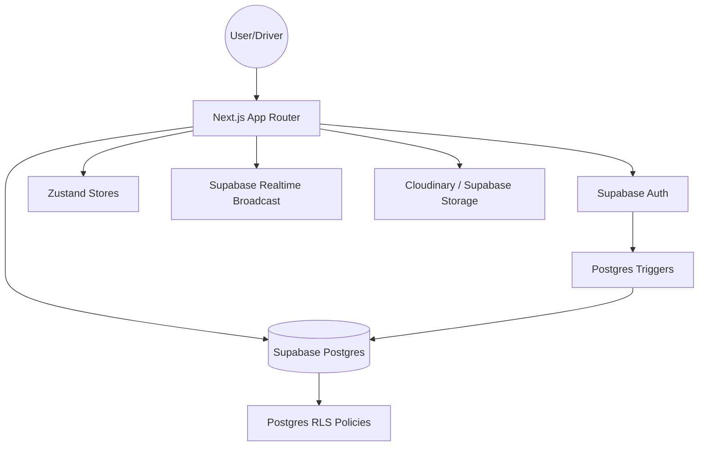

# Architecture Overview: Zipp (Ride-Hailing Platform)

This document provides a breakdown of the current architecture, data flow, and technology stack of the Zipp platform.

## 🏗️ High-Level Architecture

Zipp follows a modern serverless/headless architecture using **Next.js** for the frontend and **Supabase** for the backend-as-a-service.

---

## 💻 Tech Stack

- **Framework**: [Next.js 16](https://nextjs.org/) (App Router, Turbopack)
- **Styling**: Vanilla CSS, Tailwind CSS
- **Animations**: [Framer Motion](https://www.framer.com/motion/) (for parallax and UI transitions)
- **State Management**: [Zustand](https://github.com/pmndrs/zustand) (with persistence middleware)
- **Backend / DB**: [Supabase](https://supabase.com/) (Postgres + Auth + Realtime Broadcast)
- **File Uploads**: [Cloudinary](https://cloudinary.com/) (Documents & Profile Pics)
- **Mapping**: [Leaflet](https://leafletjs.com/) (via `react-leaflet`)
- **Forms**: `react-hook-form` + `zod`

---

## 📁 Directory Structure

| Directory | Purpose |
| :--- | :--- |
| `app/` | Next.js routes, layouts, and API endpoints. Organized by role groups: `(user)`, `(driver)`, `(admin)`. |
| `components/` | Reusable UI components. Organized by feature (e.g., `user/`, `shared/`, `login/`). |
| `store/` | Zustand stores for global state (Auth, Ride, Negotiation, Driver Feed). |
| `lib/` | Shared utilities, Supabase client, Pricing engine, and Cloudinary logic. |
| `sql/` | Database migrations and schema definitions (The source of truth for the DB). |
| `types/` | Global TypeScript interfaces and types. |
| `hooks/` | Custom React hooks (Realtime Broadcast, Destination Search). |

---

## 🔑 Authentication & Authorization

### Role-Based Access Control (RBAC)
User roles (`user`, `driver`, `admin`) are stored in two places:
1.  **JWT Metadata**: Persisted in Supabase Auth user metadata for fast frontend checking.
2.  **Database Profiles**: The `user_profiles` and `driver_profiles` tables store persistent role data.

### Row Level Security (RLS)
The database is secured via Postgres RLS policies.
- **Select**: Users can only see their own profiles; Drivers can see requested bookings in the global feed.
- **Negotiation**: Bids are only viewable by the two participants of a specific ride.
- **Insert**: Controlled via triggers (`handle_new_user`) that automatically create profiles on signup.

---

## 🔄 Core Data Flows

### 1. Driver Onboarding
1.  **Signup**: Google OAuth starts the flow.
2.  **Callback**: Role is synced from URL params to Auth metadata.
3.  **Persistence**: `DriverOnboardingPage` uses `upsert` at every step to save progress in real-time.

### 2. Real-Time Ride Broadcast
1.  **Broadcast**: Passenger creates a ride. The server broadcasts `new_ride_request` to all online drivers.
2.  **Acceptance**: Driver clicks "Accept". The status updates to `negotiating` in the DB, and a `ride_taken` signal clears other driver feeds.

### 3. Negotiation Room
1.  **Shared Room**: Both parties enter a private broadcast channel `negotiation:{ride_id}`.
2.  **Bidding**: Zustand `negotiationStore` tracks the live bid history.
3.  **Finalization**: When a bid is accepted, the fare is committed to the `ride_requests` table, and both parties are redirected to confirmation screens.

---

## 🗄️ Database Schema Key Tables

| Table | Description |
| :--- | :--- |
| `ride_requests` | Short-lived broadcast records with real-time status transitions. |
| `negotiation_bids` | Audit log of all counter-offers for every ride. |
| `pricing_events` | Machine Learning training data tracking suggested vs negotiated prices. |
| `user_profiles` | Core account data for regular passengers. |
| `driver_profiles` | Detailed professional info, verification status, and online toggle. |

---

## 📡 Integrations

- **Supabase Realtime**: Used for global broadcasts (feeds) and private room signals (negotiations).
- **Cloudinary**: Used for secure "Sign" uploads of driver documents.
- **Leaflet**: Integrated wrapper (`UserMapWrapper`) for interactive map displays and driver simulations.
- **Pricing Engine**: Custom `lib/pricing.ts` using distance, fuel prices, and real-time demand ratios.
